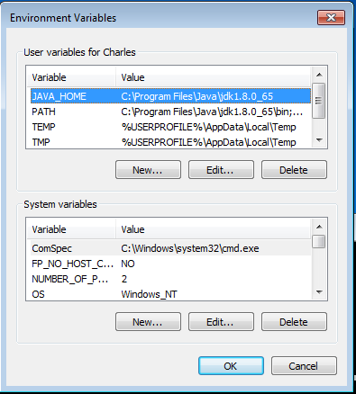
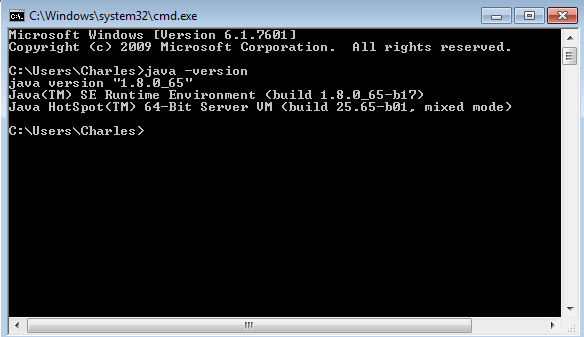

#Installing and Running Drill
Drill can be used on a single computer, known as _embedded mode_ or can be installed on a Hadoop cluster, which is referred to as _distributed mode_.  This chapter will walk you through installing Drill in either configuration and configuring your system to work with Drill. It is important to note that you can really do a lot with Drill without having to have a Hadoop cluster at your disposal.

Once Drill is installed, there are several ways of interacting with it.  In addition to the command line interface, you can interact with Drill using most business intelligence tools through Drill's ODBC/JDBC interface, and finally, Drill comes with a web interface.  We will cover these interfaces in later sections. 

If you are just wanting to experiment with Drill, it is available pre-installed in a few publicly available virtual machines such as the Merlin Distro for Data Science, the MapR Sandbox, the Cloudera Quickstart VM and others. 

##Preparing your Machine for Drill
Before you install Drill on any machine, you will need Oracle Java SE Development Kit 7 (JDK 7) installed which is available here: http://bit.ly/jdk7dl.  If you already have JDK installed, you can verify the version as shown below:

	$ java -version   
	java version "1.8.0_65"    
	Java(TM) SE Runtime Environment (build 1.8.0_65-b17)  
	Java HotSpot(TM) 64-Bit Server VM (build 25.65-b01, mixed mode)  

As long as your JDK is higher than version 1.7 you can run Drill.  If you don't have JDK on your machine, simply download the executable installer from the link above and run it.  

###Special Configuration Instructions for Windows Installations
On Windows machines, you will also need to have two environment variables:

* A `JAVA_HOME` environment variable pointing to the JDK installation
* A `PATH` environment that includes the path to your JDK installation

To set these variables in Windows XP/Vista/7/8:

1. Open the Contol Panel -> System -> Advanced System Settings
2. Switch to the _Advanced_ tab and click on _Environment Variables_
3. In _System Variables_ scroll down to `PATH` and click on Edit.
4. Add `C:\Program Files\Java\jdk1.x.x_xx\bin;` replacing `xx` with the exact version number you downloaded, in front of all existing entries.  Do NOT delete any existing entries as it may cause other applications not to run. 
5. Repeat this process for the `JAVA_HOME` variable.



Once you have installed Java and set the environment variables, you can confirm that your installation is working correctly by typing `java -version` at a command prompt and you should receive the result shown below.



Lastly, for Windows you will also need a program which can decompress `tar` files such as 7-zip which is available at http://www.7-zip.org.

##Installing Drill in Embedded Mode on Windows

Once you have Java correctly configured on your machine, installing Drill on a Windows machine is essentially the same process as for Mac or Linux. 

1.  Download the latest version of Drill at http://getdrill.org/drill/download/apache-drill-<version>.tar.gz
2. Move the file to the directory where you want to install Drill. 
3. Using 7-Zip, or whichever extractor you have, unzip the file and the underlying TAR file into the director of your choosing. 

##Starting Drill on a Windows Machine

Open a command prompt and navigate to the directory where you unzipped Drill.  Once you are there, navigate to the `bin` directory by typing `cd bin`.  Next, type the command `sqlline.bat -u "jdbc:drill:zk=local"` at the command prompt.  If all went well you should get the Drill prompt.   

From here, you can enter SQL queries at the prompt.  As part of the default installation, Drill includes a number of demonstration data sets, and among these is a file called `employee.json` that contains nominal data about an organization's employees.  In order to verify that your installation is working properly, enter the query at the Drill prompt:

	SELECT education_level, COUNT( * ) AS person_count
	FROM cp.`employee.json`
	GROUP BY education_level
	ORDER BY person_count DESC; 

If all is working properly, you should see an ASCII table of the data.  

	0: jdbc:drill:zk=local> SELECT education_level, COUNT( * ) AS person_count
	. . . . . . . . . . . > FROM cp.`employee.json`
	. . . . . . . . . . . > GROUP BY education_level
	. . . . . . . . . . . > ORDER BY person_count DESC;
	+----------------------+---------------+
	|   education_level    | person_count  |
	+----------------------+---------------+
	| Partial College      | 288           |
	| Bachelors Degree     | 287           |
	| High School Degree   | 281           |
	| Graduate Degree      | 170           |
	| Partial High School  | 129           |
	+----------------------+---------------+
	5 rows selected (0.195 seconds)

Drill does not support distributed mode on Windows machines, so at this point your Drill installation is working and you can skip to the next chapter about connecting Drill to data sources. 

To quit the Drill shell, type `!quit`.


##Installing Drill in Embedded Mode on Mac or Linux
Installing Drill on a Mac or Linux is as simple as downloading the files and unzipping it.  Depending on your system, either one of these commands will download the file.  

    wget http://getdrill.org/drill/download/apache-drill-<version>.tar.gz
    curl -o apache-drill-<version>.tar.gz http://getdrill.org/drill/download/apache-drill-<version>.tar.gz   

After you have moved Drill to the desired location, simply decompress it:
 
    tar -xvzf apache-drill-<version>.tar.gz

If you didn't add the Drill executables to the `PATH` variable, you might want to add the following line to your `.bash_profile` as a convenience.

    alias startDrill='<path to drill>/bin/drill-embedded'

This will allow you to start Drill by typing `startDrill` at the command line.  At this point, you are ready to run Drill.

##Starting Drill on Mac or Linux in Embedded Mode
To start Drill after installing it, navigate to the path where you extracted the Drill files and execute the following command:

	$ ./bin/drill-embedded 
You should get a prompt as shown below:

	Java HotSpot(TM) 64-Bit Server VM warning: ignoring option MaxPermSize=512M; support was removed in 8.0
	Jan 04, 2016 11:09:55 AM org.glassfish.jersey.server.ApplicationHandler initialize
	INFO: Initiating Jersey application, version Jersey: 2.8 2014-04-29 01:25:26...
	apache drill 1.4.0 
	"a drill is a terrible thing to waste"
	0: jdbc:drill:zk=local> 

From here, you can enter SQL queries at the prompt.  As part of the default installation, Drill includes a number of demonstration data sets, and among these is a file called `employee.json` that contains nominal data about an organization's employees.  In order to verify that your installation is working properly, enter the query at the Drill prompt:

	SELECT education_level, COUNT( * ) AS person_count
	FROM cp.`employee.json`
	GROUP BY education_level
	ORDER BY person_count DESC; 
If all is working properly, you should see an ASCII table of the data.  

	0: jdbc:drill:zk=local> SELECT education_level, COUNT( * ) AS person_count
	. . . . . . . . . . . > FROM cp.`employee.json`
	. . . . . . . . . . . > GROUP BY education_level
	. . . . . . . . . . . > ORDER BY person_count DESC;
	+----------------------+---------------+
	|   education_level    | person_count  |
	+----------------------+---------------+
	| Partial College      | 288           |
	| Bachelors Degree     | 287           |
	| High School Degree   | 281           |
	| Graduate Degree      | 170           |
	| Partial High School  | 129           |
	+----------------------+---------------+
	5 rows selected (0.195 seconds)

At this point your Drill installation is working and you can skip to the next chapter about connecting Drill to data sources.

To quit the Drill shell, type `!quit`.


##Installing Drill on a Mac or Linux Machine in Distributed Mode

While Drill can significantly improve data exploration and analysis on one machine, its real power comes from running Drill in distributed mode where you can query multiple data sets _in situ_.  This section will assume that you have a working cluster and will cover how to set it up to work with Drill.  We will not cover how to setup a Hadoop or MongoDB cluster. 

###Preparing Your Cluster for Drill
Before you install Drill on a cluster your cluster must have the following installed:

* Oracle Java SE Development Kit 7 (JDK 7) installed which is available here: http://bit.ly/jdk7dl.
* ZooKeeper Quorum which is available here: http://bit.ly/zkeep
* (Optional but recommended) Hadoop
* (Optional but recommended) DNS

You can use Drill in distributed mode with a Hadoop, MongoDB cluster or other similar big-data distributed computing platforms that Drill supports.  It is not necessary to use distributed mode solely to query multiple data sources with Drill.  

###Installing and Configuring ZooKeeper
If you are planning on using Drill to query data on disperate servers, you must first install and configure ZooKeeper on each node.  If you've never done it before, it can be a little tricky, so we'll walk you through setting up a small cluster with three nodes.  **You will need to repeat this process for each server in your cluster.**

####Setting up DNS 
Unless you like working with IP addresses, you'll find it much easier to use your server's DNS records instead of the raw IP addresses.  To set up DNS, you'll have to edit each computer's `hosts` file, which on *NIX systems can be found in the `/etc/hosts` file.  Using your favorite text editor, open this file (you may need admin privileges) and you should see something like this:

	127.0.0.1       localhost
	127.0.1.1       my-machine
	
Next, add an entry for each machine in your cluster as shown below, replacing the IP addresses with the actual IPs for your nodes:

	127.0.0.1       localhost
	127.0.1.1       my-machine
	10.10.10.2      drillnode1
	10.10.10.3      drillnode2
	10.10.10.4      drillnode3

Once you've saved this file, verify that everything is working by typing `ping drillnode1`.  You should see something like this:

	$ ping drillnode1
	PING drillnode1 (10.10.10.2) 56(84) bytes of data.
	64 bytes from drillnode1 (10.10.10.2): icmp_seq=1 ttl=64 time=0.030 ms
	64 bytes from drillnode1 (10.10.10.2): icmp_seq=2 ttl=64 time=0.042 ms
	64 bytes from drillnode1 (10.10.10.2): icmp_seq=3 ttl=64 time=0.130 ms
	64 bytes from drillnode1 (10.10.10.2): icmp_seq=4 ttl=64 time=0.042 ms
	64 bytes from drillnode1 (10.10.10.2): icmp_seq=5 ttl=64 time=0.048 ms
	^C
	--- drillnode1 ping statistics ---
	5 packets transmitted, 5 received, 0% packet loss, time 3996ms
	rtt min/avg/max/mdev = 0.030/0.058/0.130/0.036 ms

Once you have verified that the DNS is working properly and you are able to ping the other nodes, you are ready to install ZooKeeper.	
####Configuring ZooKeeper
Now that you've configured DNS, the next step is to install and configure ZooKeeper.  
First you'll need to download ZooKeeper here (http://bit.ly/zkeep), copy it to a working directory such as `/opt`.  At the time of writing, the most current version of ZooKeeper is 3.4.6.   Once there, decompress it by typing `tar -xvf zookeeper-<version>.tar`.  

Next, you will have to add the cluster nodes to the ZooKeeper configuration files.  Again, using your favorite text editor and using admin access, open `<path to zookeeper>/conf/zoo.cfg`.  There are a few variables which are crutial to ZooKeeper functioning correctly.  The first is the `dataDir`.  This must be set to a writeable directory.  Make sure you take note of the `dataDir` path, because we will need it for the next step.  Once you've set the dataDir path you'll need to add a listing for every node in your cluster.  The format is: `server.x=<node-name or IP>:port1:port2.` You will need to copy this configuration file on all nodes in your cluster.  The final `zoo.cfg` should look something like this:

	tickTime=2000
	dataDir=/home/<user-name>/zookeeper-data
	dataLogDir=/var/log
	
	clientPort=2181
	initLimit=10
	syncLimit=5
	server.1=drillnode1:2888:3888
	server.2=drillnode2:2888:3888
	server.3=drillnode3:2888:3888

Once you've set up the `zoo.cfg` file, navigate to your data directory and create a file called `myid` which should only contain the identifying number of the node.  So if you are creating this file on `drillnode1`, all it should contain is `1`.  Repeat this process for every node on your cluster, substituting the correct id for each server.

####Open Ports for ZooKeeper and Drill
Finally, the last step you'll need to complete is making sure that the correct ports are open for ZooKeeper and Drill. Unless you have changed this in the configuration files, ZooKeeper uses ports 2181, 2888 and 3888.  Additionally, Drill uses TCP ports 8047, 31010, 31011, 31012 and UDP port 46655.  

#####Easy Option: Uncomplicated Firewall
If you are using Ubuntu, uncomplicated firewall should be included in your distribution.  (If not, you can install it `sudo apt-get install ufw`).  First check to see what ports are already opened by typing `sudo ufw status`.  If all these ports are open, you are ready to start the services.  If not, you'll need to open them as follows: `sudo ufw allow 2181`.  Repeat this for all the ports listed above. Once you have opened all the ports, type `sudo ufw enable`.  It's probably a good idea to check the status again by typing `sudo ufw status` to confirm that you have in fact opened all the correct ports.

#####More Complicated Option:  IPTables
If you don't have `ufw` installed, you can open the ports via iptables.  

	$ /sbin/iptables -A INPUT -m state --state NEW -m tcp -p tcp --dport 2181 -j ACCEPT
	$ service iptables save  
Repeat this process for all the necessary ports. The final drill port, 46655 must be open for UDP rather than TCP.  

###Starting ZooKeeper
Now that you have configured ZooKeeper, the next step is to start the ZooKeeper daemon on each node.  Navigate to `<zookeeper-install>/bin/` and run `./zkServer start`.  Once the process is running on all servers, type `./zkServer status` to confirm that ZooKeeper is running correctly.

###Installing Drill on Your Cluster
Installing Drill on cluster nodes follows the essential same process as installing Drill with one additional step of modifying the `drill-override.conf` to connect the node to the cluster.  

Depending on your system, either one of these commands will download the file.  

    wget http://getdrill.org/drill/download/apache-drill-<version>.tar.gz
    curl -o apache-drill-<version>.tar.gz http://getdrill.org/drill/download/apache-drill-<version>.tar.gz   

After you have moved Drill to the desired location, simply decompress it in the directory of your choice, such as `/opt`:
 
    tar -xvzf apache-drill-<version>.tar.gz

Finally, you will need to configure the node to communicate with ZooKeeper.  To do this, you will need to modify the `drill-override.conf` which can be found in the `<path to drill>/conf/drill-override.conf`.  You will have to configure each node with a `cluster-id` as well as the ZooKeeper host names and port numbers.  The `cluster-id` should be the same for all nodes in your Drill cluster and the default ZooKeeper port is 2181.

	drill.exec:{
  		cluster-id: "<mydrillcluster>",
  		zk.connect: "<zkhostname1>:<port>,<zkhostname2>:<port>,<zkhostname3>:<port>"
	 }
	 
##Starting Drill in Distributed Mode
I order for Drill Each node in your Drill cluster every node must have a Drill daemon--known as a *drillbit* running on that node. After configuring each node, as described above, you now have to start the Drill bit.  

```
<path to drill>/bin/drillbit.sh start
```

You can start, restart, stop, check the status of the daemon, or set it to autorestart with the same script as follows:
```
<path to drill>/bin/drillbit.sh (start|stop|restart|status|autorestart)
```
Once you've started the Drill daemon on every node in your cluster, you are ready to connect to the cluster.  

### Connecting to the Cluster
The final step is starting the Drill shell from one of the nodes which has ZooKeeper installed on it.  On that machine, execute the following command:
```
<path to drill>/bin/drill-localhost
```
If all goes well, the Drill shell will open.  Execute the following query to verify the connection to the Drillbit: 
```
SELECT * FROM sys.drillbits 
```
##Conclusion
If you've been following along on your computer, you should have a functioning installation of Apache Drill and are ready to query data on it.  If you would like to try Drill out in distributed mode, you can download a virtual cluster here (XXX) which will enable you to experiment without having to go through the installation process. 

 
