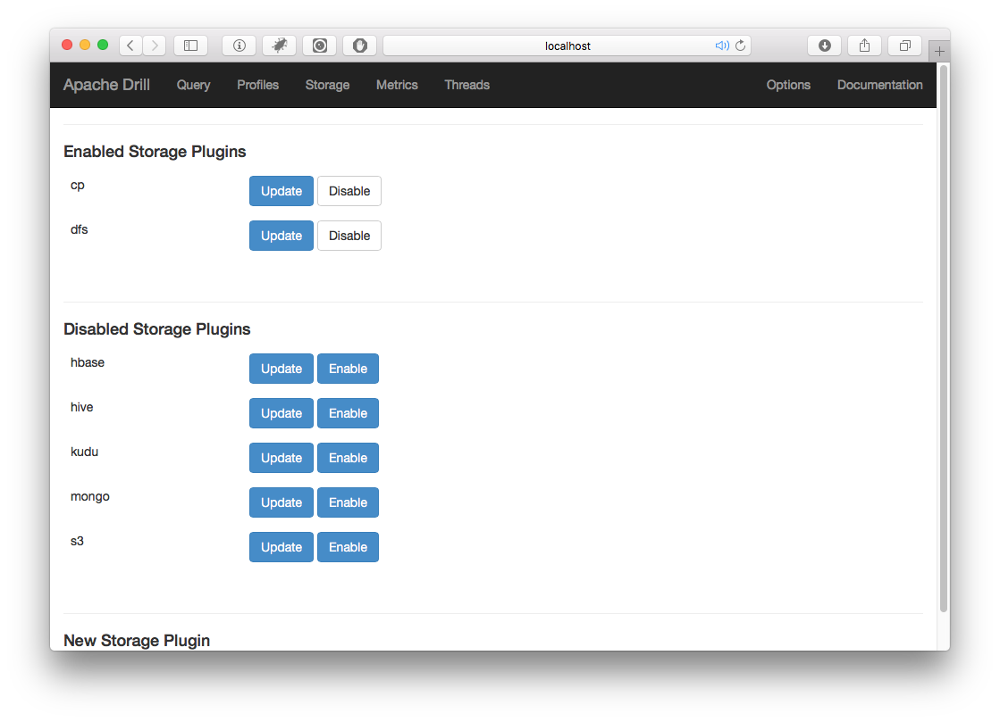

#Querying Delimited Data
In this chapter we will explore how to get started with Drill by quering simple data.  I'm defining simple data as data contained in a delimited file such as a spreadsheet or CSV file, from a single source.  If you have worked with SQL databases, you will find that querying simple data with Drill is not much different than querying data from a relational database.  However, there are some important differences which are important to understand in order to unleash the full power of Drill.  We assume that you are familiar with basic SQL syntax, but if you are not, we recommend *SQL for Mere Mortals* by John Viescas as a good SQL primer. 

In order to follow along, start Drill in embedded mode as explained in the previous chapter and download the example files which are available here: XXXX

##Ways of Querying Drill
Drill is very flexible and provides you with several different ways of querying data. You've already seen that Drill has a command line interface known as *sqlline*.  In addtion to the command line, Drill has a web interface which you can access by opening a browser (once Drill is running) and navigating to http://localhost:8047, as seen below. 


###Other Interfaces
You can also query data with Drill by using Drill's RESTful interface or by using a conventional tool such as Tableau and using Drill's ODBC or JDBC interfaces.  We will be covering these interfaces later in the book and will demonstrate how to query Drill using your favorite scripting languages such as Python or R to interact with Drill. 

Lastly, if you install the MapR ODBC Drivers for Drill, bundled with that is a tool called *Drill Explorer* which is another GUI for querying Drill.  

For the beginning examples, I recommend that you start out by using the web interface because there are certain features which are most easily accessed through the web interface.

##SQL Query Format
If you are comfortable with relational databases much of Drill's SQL syntax will look very familiar to you.  Let us start with a basic query.  Every SQL `SELECT` query essentially follows this format:

```
SELECT <list of fields>
FROM <one or more tables> 
WHERE <some logical condition>
(Optional) GROUP BY <some field>
(Optional) ORDER BY <some field>
```
Again, this should look relatively familiar to you and this chapter will focus on Drill's unique features in SQL.

###Choosing a Data Source
In most ways, Drill behaves like a traditional relational database, with the major difference being that Drill treats files (or directories) as tables.  Drill can also connect to relational databases or other structured data stores such as Hive, or HBase, but for now, let us look at querying a simple CSV file in Drill:

```
SELECT first_name, last_name, street_address, age
FROM dfs.user_data.`users.csv`
WHERE age > 21
```
This query, queries a sample data file called `users.csv`, and returns the first name, last name and street address of every user where their age is greater than 21. If you are familiar with relational databases, the only part which looks unusual is the line containing: 

```
FROM dfs.user_data.`users.csv`
```
In a traditional database, the `FROM` clause contains the names of tables, or optionally the names of additional databases and associated tables.  However, Drill treates files as tables, so in this example, you are seeing how to tell Drill which file query. 

In Drill terminology, the data sources are called storage plugins and the kind of system your data is stored in will dictate what storage plugin you use.  In Drill, the `FROM` clause has three components which do slightly different things depending on what kind of storage plugin you are using. The components are the *storage plugin*, the *workspace* and the *table*.  In the example above, `dfs` is the storage plugin which stands for *drill file system* and is used to access files which are stored on the local system's hard disk.  The next component is optional and is the workspace which is a shortcut to a file path on your system.  If you did not want to use the workspace, you could enter:

```
FROM dfs.`<full path>/users.csv`
```

Finally, there is the table which in this storage plugin corresponds to a file or directory.  In addition to the `dfs` plugin, Drill ships with the `cp` or *Classpath* plugin enabled which queries files stored in one of the directories in your Java ClassPath. 

As illunstrated in figure X.X , the Storage Configuration planel is where you can enable, disable and configure the various storage plugins.  Resist the temptation to enable all the disabled plugins, because you will get bad performance and strange error messages if you try to use Drill with an improperly configured storage plugin enabled.

###Defining a Workspace
In order to create a workspace, open the Drill web interface, and click on the Storage tab at the top of the screen.  

Next, click on the *update* button next to the *dfs* plugin and you will see the configuration variables.  You will see a section called *workspaces* and in it you will see the default workspaces: `root` and `tmp`:

```
"workspaces": {
    "root": {
      "location": "/",
      "writable": false,
      "defaultInputFormat": null
    },
    "tmp": {
      "location": "/tmp",
      "writable": true,
      "defaultInputFormat": null
    }
 },
```
To create your own workspace, simply add another entry into the workspaces section with a path to a location on your local disk. 

```
"drill_tutorial": {
      "location": "<your path>",
      "writable": true,
      "defaultInputFormat": null
    }
```

You must have read permission in order to be able to read data in your workspace.  You can configure workspaces as being writable or not as well as setting a default file format, and it goes without saying that if you wish to write to this path, you must also have write permissions.  Once you've entered your own workspace, click on the *update* button at the bottom of the screen.  

You can verify that your workspace was successfully created by executing a `SHOW DATABASES;` query and you should see your newly created workspace in the results.  

###Specifying a Default Data Source
Since Drill uses file paths in the `FROM` clause, these clauses can get lengthy.  Drill allows you to specify a default data source via the `USE` operator and once you've done this, all you need to do is specify the file or directory.  For example:

```
USE dfs.data;
SELECT * 
FROM `users.csv`
WHERE age > 20  
```
Once you've used the `USE` operator, it is effectively like prepending whatever namespace to your `FROM` clause.  So the query above, is functionally equivalent to the query below.  Note that the `USE` operator only works in the command line interface and has no effect in web sessions or queryies using the RESTful interface.
```
SELECT * 
FROM dfs.data.`users.csv`
WHERE age > 20  
```
Once you have specified a namespace with the `USE` operator, you can still access other namespaces, but you will have to explicitly list them.  For example:

```
USE dfs.data
SELECT * 
FROM `users.csv` AS u
INNER JOIN dfs.logs.`logfile.txt` AS l ON l.id=u.id
```
You can see in the query above that the query joins data from `users.csv` with another file called `logfile.txt` which is in a completely different namespace.
####Saving your Settings 
By default, in embedded mode Drill saves all settings in the `/tmp` directory which does not persist once Drill is shut down. In order to make your settings persist, you will need to modify the `drill-override.conf` which is located in the `<drill-home>/conf/ folder`, by adding: `sys.store.provider.local.path="<path to directory>"` to the section `drill.exec`, and adding a non-temporary path.  

```
drill.exec: {
    cluster-id: "drillbits1",
    zk.connect: "localhost:2181"
 }
 
sys.store.provider.local.path="<path-to-save-file>"
```

####A Word about case sensitivity in Drill
In general, Drill is case-insensitive, and it is a general convention for SQL operators to be typed in all caps. However, there are a few instances in which Drill is case-sensitive which are important to remember.  I would recommend treating everything in Drill as if it is case-sensitive and then you won't have any problems. 

|Command/Use   |Case Sensitive   |
|---|---|
|Storage Plugin Names  |yes   |
|Workspace Names   |yes   |
|File paths   |yes |
|SQL Commands | no |
|Column names| generally no |
|JSON Field Names | no |
|Hive | no |
|HBase | yes|

###Accessing Columns in a Query 
Relational databases are considered *schema on write* in that the schema must be defined prior to writing the data on disk.   More recently, tools such as Apache Hive and Impala, use a technique called *schema on read* which allows more flexiblity as it allows uses to modify the schema as the data is being ingested, rather than being tied to a rigid, pre-defined schema.  

Drill takes a different approach and relies on the data's natural structure for its queries.  Let's say that we have a file called `customer_data.csv` which contains 3 columns of data: first_name, last_name, and birthday.  Drill infers the schema directly from the structure of the data and as such you do not need to define any kind of schema prior to querying your data with Drill. 

As an example, Drill will allow you to query this data directly by simply executing the following query:

```
SELECT *
FROM dfs.drill_tutorial.`customer_data.csv`
```
However, when you execute this query you will notice that Drill returns an array for each row of data as shown in the table below.   

| columns |
|---------|
|["Robert","Hernandez","5/3/67"]|
|["Steve","Smith","8/4/84"]|
|["Anne","Raps","9/13/91"]|
|["Alice","Muller","4/15/75"]|

By default, Drill can infer the structure of this data however in a simple delimited data file, you'll notice that in the results above, Drill parsed the file line by line, but returned an array of fields for each line.  This represents a major difference between Drill and relational databases in that Drill supports nested data structures such as arrays and maps wheras conventional relational databases do not.  In Drill, just as in many other programming languages, arrays are zero-indexed, meaning that the first item in an array is the *0th* item.  Individual array items are accessed using notation similar to most progamming languages:
```
arrayName[n]
```
where `n` is the numeric index of the item you wish to access.  In Drill, a dataset can contain a mix of nested columns and flat columns. 
 
Getting back to our delimited data file, if you want to access the individual columns within this array, you will have to use the `columns` array in your query which contains all the columns in a Drill array.  **Note that the `columns` must be in lower case.**  The query below demonstrates how to access these columns within a query and filter data using one of these fields.

```
SELECT columns[0] AS first_name,
columns[1] AS last_name,
columns[2] AS birthday,
FROM dfs.drill_tutorial.`customer_data.csv`
```
This query would return the data as shown in the table below. 

|first_name|last_name|birthday|
|----------|---------|--------|
|Robert|Hernandez|5/3/67|
|Steve|Smith|8/4/84|
|Anne|Raps|9/13/91|
|Alice|Muller|4/15/75|

###Delimited Data with Column Headers
If your delimited file contains headers with the column names in the first row, you can configure Drill to read those names as well.  In order to do this, you will have to open the web interface and go back to the screen where you configured the storage plugin.  In this case, click on the button to edit the `dfs` plugin and scroll down until you see the section labeled formats.  You should see some JSON which looks like this:

```
  "formats": {
    "psv": {
      "type": "text",
      "extensions": [
        "tbl"
      ],
      "delimiter": "|"
    },
    "csv": {
      "type": "text",
      "extensions": [
        "csv"
      ],
      "delimiter": ","
    }, ... 
    ,
    "csvh": {
      "type": "text",
      "extensions": [
        "csvh"
      ],
      "extractHeader": true,
      "delimiter": ","
    }
```

These options allow you to configure how Drill will interpret data files as it reads them and for delimited data, the table below contains a list of what options are available.

|Options	|Description |
|---------|-------------|
|**comment**	|What character is a comment character|
|**escape**	|Character used to escape the quote character in a field |
|**delimiter**	|The character used to delimit fields |
|**quote**	| Character used to enclose fields|
|**skipFirstLine**	|Skips first line of a file if set to true. true/false |
|**extractHeader**	|Reads the header from the CSV file. true/false|

If you would like Drill to extract the headers from the file, simply add: `"extractHeader": true,` to the section in the configuration which contains the file type you are working on.  Drill also ships configured with the `.csvh` file type configured to accept CSV files with headers.  To use this, simply rename your CSV files `.csvh`.  If you want to try this out for yourself here the query below will yield the results in the table below. 

```
SELECT *
FROM dfs.drill_tutorial.`customer_data-headers.csvh`
```

|first_name|	last_name	|birthday|
|----------|-----------|--------|
|Robert|	Hernandez|	5/3/67|
|Steve	|Smith|	8/4/84|
|Anne|	Raps|	9/13/91|
|Alice|	Muller	|4/15/75|

### Changing Configuration in a Query
The configuration options listed above should be used to set the configuration for a given storage plugin or directory.  However, you can also change these options in a query for a specific file as seen in the query below. 

	SELECT * 
	FROM table(dfs.book.`orders.csv`(type => 'text', extractHeader => true, fieldDelimiter => ','))

To use this technique, the parser does not inherit any default values and thus you have to specify a value for all the mandatory options for the file type.  In the example above, the `fieldDelimiter` field is required.  

##Querying Directories
In addition to querying single files, Drill can also be used to query directories.  In order to query directories, all the files in the directory must have the same structure and Drill effectively performs a `UNION` on the files. 

Querying a directory is fundamentally no different than querying a single file, but instead of pointing Drill to an individual file, point Drill to a directory.  Let's say that you had a directory called `logs` which contains subdirectories for each year, that finally contain the actual log files. You could query the entire collection with the following query:

```
SELECT * 
FROM dfs.`/var/logs`
```
If your directory contains subdirectories, you can access the subdirectory names by putting the `dirN` into the query.  For instance, let's say that you have log files stored in directories nested in the following format:

```
logs
|__ year
    |__month
       |__day
```

You could access the directory stucture with the following query:

```
SELECT dir0 AS year, 
dir1 AS month, 
dir2 AS day
FROM dfs.`/var/logs/`
```
Additionally, you can use wildcards in the directory name.  For instance, the query below uses wildcards to restrict Drill to only opening CSV files.

```
SELECT * 
FROM dfs.`/user/data/*.csv`
```

###Directory Functions
If you are using the dir<n> variables in the `WHERE` clause in an SQL query, it is best to use the directory functions rather than simple comparisons as it allows Drill to avoid having to make costly (and slow) full directory scans.  Drill has four directory functions which are:
* MAXDIR()
* MINDIR()
* IMAXDIR()
* IMINDIR()
This functions return the min or max values in a directory and the `IMAXDIR()/IMINDIR()` return the minimum or maximum in case-insensitive order.  

Using the previous example structure, the following query would find the most recent year directory in the logs file and return results from that directory.
```
SELECT * 
FROM dfs.`/var/logs`
WHERE dir0 = MAXDIR( dfs, '/var/logs' )
```

##Analyzing Data with Drill
One of the challenges in using Drill is that while Drill in many ways acts like a relational database, there are key areas in which it does not, and understanding these is key to getting the most out of Drill.  This section will cover the basic fundamentals of analyzing delimited data with Drill. 

###Understanding Drill Data Types
While Drill can infer the structure of data from the files, when you are querying delimited data, Drill cannot implicitly interpret the data type of each field and since there are no predefined schemata, **you will have to explicitly cast data into a particular data type in your queries in order to use it for other functions**.  As you will see in later examples The examples in this section will use a sample data file `baltimore_salaries_2015.csvh` which is included in the github repository.  For instance, the query below fails because Drill cannot infer that the Salary field is a numeric field.

	SELECT GrossPay, 
	FROM dfs.drillworkshop.`csv/baltimore_salaries_2015.csvh`
	WHERE GrossPay > 35000
	
This query fails with a NumberFormatException because the `GrossPay` field is a string.  You can check the column types by using the `typeof(<column>)` function as shown in the query below. 

	SELECT GrossPay, typeof( GrossPay ) AS column_type
	FROM dfs.drillworkshop.`csv/baltimore_salaries_2015.csvh`
	LIMIT 1

This query produces the following result:

| GrossPay | column_type | 
|----------|-------------|
| \$53,626.04 | VARCHAR |

In order to fix this problem, you will need to tell Drill what data type the `GrossPay` field is, and in order to use a comparison operator both sides of the equation will need to be numeric, and to convert the field to a numeric data type, you will need to use the `CAST( <field> AS <data type> )` function. 
 	
Drill supports the following simple data types:

|SQL Data Type|	Description  |Example|
|----------|-----------|--------|
|**BIGINT**|	8-byte signed integer in the range -9,223,372,036,854,775,808 to 9,223,372,036,854,775,807|	9223372036854775807|
|**BINARY**|	Variable-length byte string|B@e6d9eb7 |
|**BOOLEAN**|	True or false |true |
|**DECIMAL(p,s)**| 38-digit precision number, precision is p, and scale is s |DECIMAL(6,2) is 1234.56, 4 digits before and 2 digits after the decimal point|
|**FLOAT**|	4-byte floating point number|	0.456|
|**DOUBLE**	|8-byte floating point number, precision-scalable | 0.456 |
|**INTEGER** or **INT**|	4-byte signed integer in the range -2,147,483,648 to 2,147,483,647| 2147483646 |
|**SMALLINT**|	2-byte signed integer in the range -32,768 to 32,767 | 32000 |
| **CHAR**, **VARCHAR**|	UTF8-encoded variable-length string. The default limit is 1 character. The maximum character limit is 2,147,483,647.|	CHAR(30) casts data to a 30-character string maximum.|

We will be discussing the Date/Time functions as well as complex data types later in the book, but it is important to understand these basic data types to do even the most simple calculations. Consider the following problem:  you would like to calculate some summary statistics about the various job roles present at this notional company.  You might start with a query like this:

	SELECT position_title, AVG( GrossPay ) AS avg_pay 
	FROM dfs.drillworkshop.`csv/baltimore_salaries_2015.csvh`
	GROUP BY position_title
	ORDER BY avg_pay  DESC

However, in Drill, this query will fail for the same reason as the earlier query:  the `salary` field is not necessarily a number and thus must be converted into a numeric data type.  The corrected query would be:

	SELECT position_title, AVG( CAST( salary AS FLOAT ) )  AS avg_pay 
	FROM dfs.drillworkshop.`csv/baltimore_salaries_2015.csvh`
	GROUP BY position_title
	ORDER BY avg_pay DESC

However, this query will unfortunately also fail because there are extraneous characters such as the `$` in the `GrossPay` field.  In order to successfully execute this query, you can either use the `TO_NUMBER()` function as explained in the next section or use one of Drill's string manipulation functions to remove the `$`.  A working query would be:

	SELECT position_title, AVG( CAST( LTRIM( salary, '\$' ) AS FLOAT ) )  AS avg_pay 
	FROM dfs.drillworkshop.`csv/baltimore_salaries_2015.csvh`
	GROUP BY position_title
	ORDER BY avg_pay DESC

  
| Function	| Return Type | Description | 
|------------|--------------|------------|
|`BYTE_SUBSTR(string, start index )`	| BINARY or VARCHAR | Returns in binary format a substring of a string
|`CHAR_LENGTH( string )	`| INTEGER | Returns the number of characters in a string |
|`CONCAT(list of strings)` |	VARCHAR | Concatenates strings | 
|`ILIKE(string 1, string 2)`	| BOOLEAN | Returns true if string 1 and string 2 match (case insensitive) | 
|`INITCAP(string)`  |	VARCHAR | Returns the string with initial capital letters |
|`LENGTH(string)` |	INTEGER | Returns length of a string | 
|`LOWER(string)`	 |VARCHAR | Converts a string to lower case |
|`LPAD(string, length)`|	VARCHAR | Pads a string to the specified length by prepending the fill or a space |
|`LTRIM(string 1, string 2) `	| VARCHAR | Removes characters in string 2 from the beginning of string 1. |
|`POSITION( needle in haystack )`	| INTEGER | Returns the index of the needle string in the haystack string | 
|`REGEXP_REPLACE( source, pattern, replacement ) `	| VARCHAR  | Replaces text in the source that matches the pattern with the replacement text |
|`RPAD(string, length)`| VARCHAR |Pads a string to the specified length by appending the fill or a space |
|`RTRIM(string 1, string 2) `	| VARCHAR | Removes characters in string 2 from the end of string 1.|
|`SPLIT( string, character )` | Array | Splits the string by on the character | 
|`SPLIT_PART( string, delimiter, part )| VARCHAR | Splits a string on the specified delimiter and returns the part at the specified position |
|`STRPOS(haystack, needle)` | INTEGER | Returns the index of the needle string in the haystack string |
|`SUBSTR(string, x, y)` | VARCHAR | Extracts portion of a string from a position 1-x.  |
|`TRIM([leading | trailing | both] [string1] from string2)`	| VARCHAR | Removes characters in string 1 from string 2 |
|`UPPER(string)`	 | VARCHAR | Converts string to upper case |


###Complex Data Coversion Functions
If you have data that is relatively clean, the `CAST()` function works well, however, let's look at a real life situation in which it will fail and how to correct that problem with the `TO_` methods. 

In the XXXX there is a file called `baltimore_salaries_2015.csvh` which is a listing of the salaries of all the employees of the City of Baltimore during the year of 2015.  This data is also available here: https://catalog.data.gov/dataset/baltimore-city-employee-salaries-fy2015.  

This data contains two columns with salary data: `AnnualSalary`, and `GrossPay`.  However, if you wanted to do any kind of filtering or analysis using these columns, you'll notice that we have two problems which will prevent you from performing any kind of numeric operation on these columns:

1. Each salary begins with a `$`
2. Each salary also has a comma separating the thousands field. 

If you attempt to use the `CAST( <field> AS <type>)` on these fields, it will fail due to the dollar sign, which leaves two options: 

1.  Use string manipulation functions to remove the dollar sign, then `CAST()` the result to a floating point number or 
2.  Use the `TO_NUMERIC( <field>, <format> )` function which accomplishes both tasks in one step.  

The format string accepts the following special characters:

|Symbol|	Location	|Meaning|
|------|------------|-------|
|0	|Number	| Digit |
| # | Number |	Digit, zero shows as absent
|.	|Number	|Decimal separator or monetary decimal separator|
|-|	Number|	Minus sign|
|,|	Number|	Grouping separator|
|E	|Number|	Separates mantissa and exponent in scientific notation. Need not be quoted in prefix or suffix.|
|;|	Subpattern boundary	|Separates positive and negative subpatterns|
|%	|Prefix or suffix	|Multiply by 100 and show as percentage|
| &#8240; (\u2030) |	Prefix or suffix |	Multiply by 1000 and show as per mille value |
| &#164; (\u00A4) |	Prefix or suffix	| Currency sign, replaced by currency symbol. If doubled, replaced by international currency symbol. If present in a pattern, the monetary decimal separator is used instead of the decimal separator. |
|' |	Prefix or suffix	| Used to quote special characters in a prefix or suffix, for example, "'#'#"" formats 123 to ""#123"". To create a single quote itself, use two in a row: "# o''clock".|

Therefore, to access the salary columns in the Baltimore Salaries data, we could use the following query:

	SELECT TO_NUMBER( AnnualSalary, '¤000,000' ) AS ActualPay
	FROM dfs.drillworkshop.`baltimore_salaries_2015.csvh`
	WHERE TO_NUMBER(AnnualSalary, '¤000,000')  >= 50000

##Working with Date/Times in Drill
Similar to numeric fields, if you have data that has dates or times which you would like to analyze, you will first need to explicitly convert them into a format which Drill recognizes.  For this section, we will be using a file called `dates.csvh` which contains five columns of random dates in various formats. 


There are several ways of converting dates into a usable format but I've found the most reliable way is to use the `TO_DATE( <expressiom>, <format> )` function.  This function takes two arguments: an expression which usually will be a column, and a date format which is specifys the formatting of the date which you are reading.  Unlike many relational databases, Drill uses Joda formatting for the date strings for all date/time functions. 

| Symbol | Meaning | Presentation | Examples |
|-------|---------|--------------|----------|
|G |      era   |                       text      |    AD|
|C |     century of era (>=0)    |     number    |    20
|Y   |    year of era (>=0)   |         year     |     1996|
|x |      weekyear     |                year  |        1996|
|w|      week of weekyear  |           number     |   27|
|e  |     day of week            |      number    |    2|
|E   |    day of week        |          text     |     Tuesday; Tue|
|y  |     year          |               year  |        1996|
|D  |     day of year       |           number   |     189
|M   |    month of year      |          month   |      July; Jul; 07|
|d   |    day of month      |           number  |      10|
|a   |    halfday of day     |          text    |      PM|
|K   |    hour of halfday (0~11)  |     number  |      0|
|h    |   clockhour of halfday (1~12) | number  |     12|
|H    |   hour of day (0~23)   |        number   |     0|
|k  |     clockhour of day (1~24)  |    number   |     24|
|m   |    minute of hour        |       number   |     30|
|s   |    second of minute       |      number   |     55|
|S  |     fraction of second    |       number   |     978|
|z   |    time zone               |     text    |      Pacific Standard Time; PST|
|Z   |    time zone offset/id      |    zone     |     -0800; -08:00; America/Los_Angeles|
|'   |    escape for text        |      delimiter| |
|''  |    single quote            |     literal     |  '|

###Converting Strings to Dates
To demonstrate how to to convert some dates, in the file `dates.csvh` you will see that there are five columns with random dates in the following formats:

* **date1**: ISO 8601 format
* **date2**: Standard "American" date with month/day/year
* **date3**: Written date format: 3 letter month, date, year
* **date4**: Full ISO format with timezone and day of week
* **date5**: MySQL database format (yyyy-mm-dd)

The first one is easy.  Drill's native `CAST()` function can interpret ISO 8601 formatted dates.  So the following query would work:

```
SELECT CAST( date1 AS DATE ) 
FROM dfs.drilldata.`dates.csvh`
```
The second example is a little trickier.  For this example, the month is first and the day is second.  In order to ingest dates in this format, you will need to use the `TO_DATE(<expression>, <format string>)` function as shown below. 

```
SELECT date2, TO_DATE( date2, 'MM/dd/yyyy' ) 
FROM dfs.drilldata.`dates.csvh` 
```
The third column are dates that are formatted more in "plain text": **Sep 18, 2016** for instance.  For these dates, you'll also have to use the `TO_DATE()` function but with a slightly different format string:

```
SELECT date3, TO_DATE( date3, 'MMM dd, yyyy' ) 
FROM dfs.drilldata.`dates.csvh` 
```
The fourth column introduces some additional complexity in that it has a time value as well as a timezone as you can see here.  `Sun, 19 Mar 2017 00:15:28 -0700`  It can be ingested using the `TO_DATE()` function, however in doing so, you will lose the time portion of the time stamps.  Drill has a function called `TO_TIMESTAMP()` that is similar to `TO_DATE()` but retains the time components of a date/time. 

```
SELECT date4, TO_TIMESTAMP( date4, 'EEE, dd MMM yyyy HH:mm:ss Z' ) 
FROM dfs.drilldata.`dates.csvh` 
```
The final column in this exercise, date5, has dates in the format of YYYY-MM-DD which is very commonly found in databases.  It can be easily parsed using the `TO_DATE` function as shown in the query below. 
	
	SELECT date5, TO_DATE( date5, 'yyyy-MM-dd' )
	FROM dfs.drilldata.`dates.csvh`

###Reformatting Dates
If you have a date or a time that you would like to reformat for a report, you can use the `TO_CHAR(<date/time expression>, <format string> )` to convert a Drill datetime into a formatted string.  Like the `TO_DATE()` function, `TO_CHAR` uses Joda date formatting.

|You have a: |You want a: | Use |
|----------|----------|-----|
| String | Date | `TO_DATE()` or `CAST( <Field> AS DATE )` |
|String | Time | `TO_TIMESTAMP()` |
| Date | Formatted String |  `TO_CHAR( <field>, <format string> )` |

###Date Arithmetic 


###Reformatting Numbers
The `TO_CHAR()` function can also be used to both round numbers or otherwise reformat them into a more human-readable format.  If you are using `TO_CHAR()` for this purpose, you'll need to use the formatting string opertors that can be found in Table X.X.

##Data Analysis in Drill
Much like any database, Drill has a variety of mathematical functions which you can use in the `SELECT` statements to perform calculations on your data.  You can apply one of these functions to a column or nest functions and the result will be a new column.  Drill currently supports the following operations:

|Function	| Return Type |	Description |
|---------|-------------|--------------|
|ABS(x)|	Same as input|	Returns the absolute value of the input argument x.|
|CBRT(x)|	FLOAT8	|Returns the cubic root of x.|
|CEIL(x)	|Same as input|	Returns the smallest integer not less than x.|
|CEILING(x)|	Same as input|	Same as CEIL.|
|DEGREES(x)|	FLOAT8	|Converts x radians to degrees.|
|E()|	FLOAT8	|Returns 2.718281828459045.|
|EXP(x)|	FLOAT8|	Returns e (Euler's number) to the power of x.|
|FLOOR(x)	|Same as input	|Returns the largest integer not greater than x.|
|LOG(x)|	FLOAT8	|Returns the natural log (base e) of x.|
|LOG(x, y)|	FLOAT8	|Returns log base x to the y power.|
|LOG10(x)	|FLOAT8 |	Returns the common log of x.|
|LSHIFT(x, y)	 |Same as input	|Shifts the binary x by y times to the left.|
|MOD(x, y)	|FLOAT8|	Returns the remainder of x divided by y.|
|NEGATIVE(x)	|Same as input|	Returns x as a negative number.|
|PI	| FLOAT8	|Returns pi.|
|POW(x, y)|	FLOAT8	|Returns the value of x to the y power.|
|RADIANS	|FLOAT8|	Converts x degress to radians.|
|RAND	|FLOAT8|	Returns a random number from 0-1.|
|ROUND(x)|	Same as input|	Rounds to the nearest integer.|
|ROUND(x, y)|	DECIMAL	|Rounds x to y decimal places.|
|RSHIFT(x, y)|	Same as input|	Shifts the binary x by y times to the right.|
|SIGN(x)|	INT	|Returns the sign of x.|
|SQRT(x)|	Same as input|	Returns the square root of x.|
|TRUNC(x, y)|	Same as input	|Truncates x to y decimal places. Specifying y is optional. Default is 1.|
|TRUNC(x, y)|	DECIMAL|	Truncates x to y decimal places.|

All of these functions require the inputs to in some numeric data type, so don't forget to convert your data into a numeric format before using one of these columns.  The example below demonstrates how to calculate the square root of a column using Drill's `SQRT()` function.

	SELECT x, SQRT( CAST( x AS FLOAT) ) AS sqrt_x 
	FROM dfs.data.csv

This query would return:

| x | sqrt_x |
|---|--------|
|4|2|
|9|3|
|16|4|


##Summarizing Data with Aggregate Functions

In addition to the standard mathematical functions, Drill also includes the following aggregate functions which perform a calculation on an entire column or grouping within a column. These functions are extremely useful when summarizing a data set.  A complete explanation of grouping in SQL is available in chapters 13 and 14 of *SQL for Mere Mortals*.  However, the essential structure of a query which summarizes data is:

	SELECT <unique field>, OPERATION( <field> )
	FROM <data>
	WHERE <logical condition>  (Optional)
	GROUP BY <unique field>
	HAVING <logical condition> (Optional)
	
For example, the book repository contains a datafile called `ordes.csvh` which contains notional sales data for one month.  If you wanted to summarize this data you might write a query such as the one below which calculates the smallest purchase, largest purchase, number of orders, average purchase amount and the standard deviation, grouped by day.

	SELECT EXTRACT(day FROM TO_DATE( order_date, 'yyyy-MM-dd' ) ) AS day_of_month,
	SUM( CAST( purchase_amount AS FLOAT ) ) AS daily_total,
	MAX( CAST( purchase_amount AS FLOAT ) ) AS largest_order,
	MIN( CAST( purchase_amount AS FLOAT ) ) AS smallest_order,
	COUNT( order_id ) AS order_count,
	AVG( CAST( purchase_amount  AS FLOAT ) ) AS average_order,
	STDDEV( CAST( purchase_amount AS FLOAT ) ) AS std_dev_order
	FROM dfs.book.`orders.csvh`
	GROUP BY TO_DATE( order_date, 'yyyy-MM-dd' ) 	ORDER BY SUM( CAST( purchase_amount AS FLOAT ) ) DESC


If this was data to be presented, you could format the numbers with a currency symbol and round the 

|Function | Return Type | Description | 
|---------|-------------|-------------|
|AVG(column)| Same as data argument type| Returns the average of the expression|
|COUNT(*) | BIGINT | Returns the number of rows |
|COUNT( DISTINCT \<expression\>) | BIGINT | Returns the number of unique values and the number of times they occurred |
|MAX(column) | Same as argument type | Returns the largest value in the expression | 
|MIN(column) | Same as argument type | Returns the smallest value in the expression |
|STDDEV( column ) | Decimal |  Returns the standard deviation of the column | 
|STDDEV_POP( column ) | Decimal | Returns the sample standard deviate of input column |
|STDDEV_SAMP( column ) | Decimal | Returns the population standard deviate of input column |
|SUM(column) | Same as argument type |  Returns the sum of the given column | 
| VARIANCE(column) | Decimal |  Sample variance of input values (sample standard deviation squared) |
VAR_POP( column ) | Decimal | Population variance of input values (the population standard deviated squared) |
	
One major difference between Drill and relational databases is that Drill does not support column aliases in the `GROUP BY` clause.  Thus the following query would fail:

	SELECT YEAR( date_field ) as year_field, COUNT(*)
	FROM dfs.test.`data.csv`
	GROUP BY year_field
	
### Other Analytic Functions
In addition to the simple aggregate functions, Drill has a series of 

##Common Problems in Querying Delimited Data
Since Drill allows you to query raw delimited data which was not designed to be queryied by Drill, it is quite likely that you will encounter certain problems along the way.  A little understanding of Drill can help you quickly get around these problems.

###Spaces in Column Names
If your data has spaces, or other reserved characters in the column name, or the column name itself is a reserved word, this will present a problem for Drill when you try to use the column name in the query.  The easiest solution for this problem is to enclose all the column names in backticks throughout your query.

For instance, this query will throw an error:

	SELECT customer name, dob
	FROM dfs.`customers.csv`
whereas this query will not:

	SELECT `customer name`, `dob`
	FROM dfs.`customers.csv`
	
Sometimes also, columns can have spaces at the end of the field name.  Enclosing the field name in back ticks can solve this problem as well. For example:

	SELECT `field_1 `
	FROM ...
	

###Illegal Characters in Column Headers
I encountered this problem recently and it took me quite some time to diagnose it.  Essentially, I was querying a series of CSV files, and while I could query the files using `SELECT *` or most of the field names, the field I was interested in happened to be the last field in the row.  When I tried to query that field specifically, I got an index out of bounds exception.  

The reason for the error was that some of the CSV files were saved on a Windows machine which encodes new lines with both a carriage return character (\r) and a newline character (\n), wheras Macs and Linux based systems encode line endings with just the newline character (\n).  In practice what this meant was that the last field had an extra character in the field name so when I tried to query it without that character, Drill couldn't find the field and threw an exception. 

The easiest solution is to make sure that all your files are encoded using the Linux/Mac standard and that way you won't have any such problems.  

###Column Aliases
Drill treats column aliases a little differently than a relational database.  In general, Drill is more restrictive than most relational datbases as to where you can use a column alias, with the biggest difference being that column aliases cannot be used in a `GROUP BY` clause.